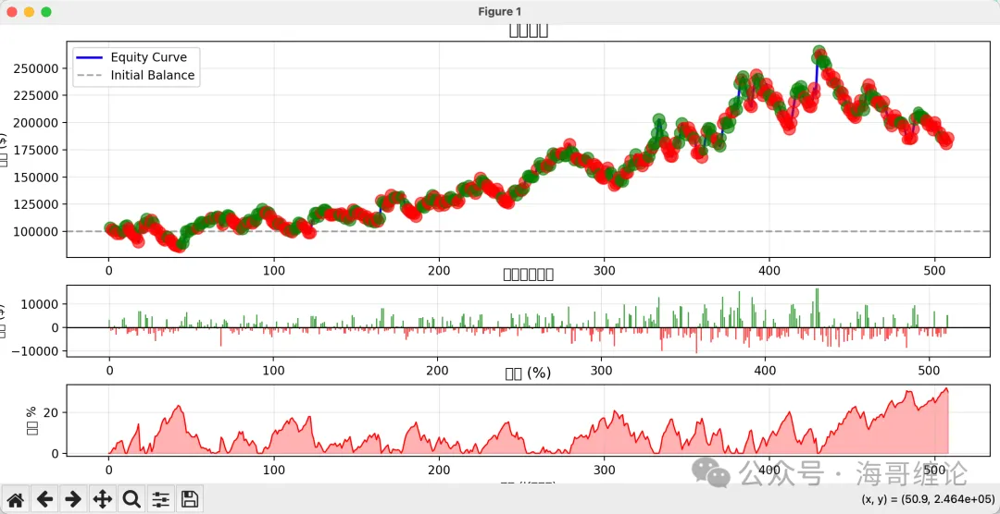
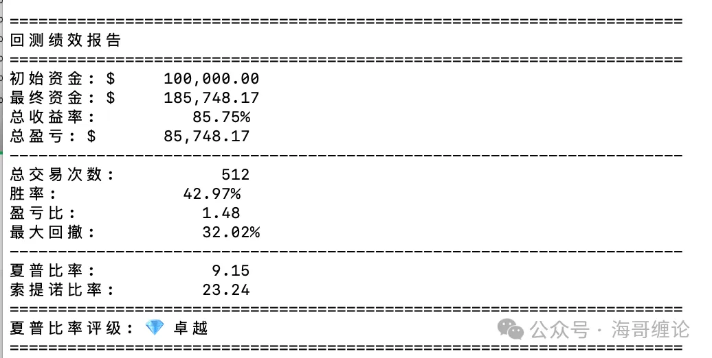
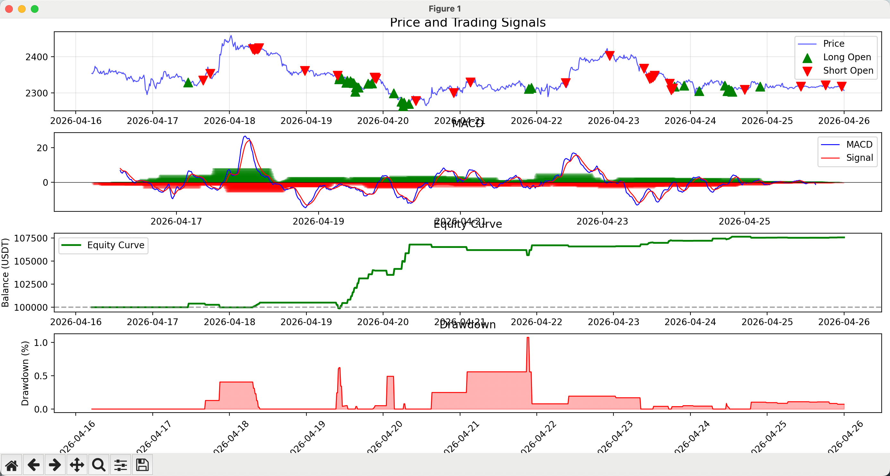
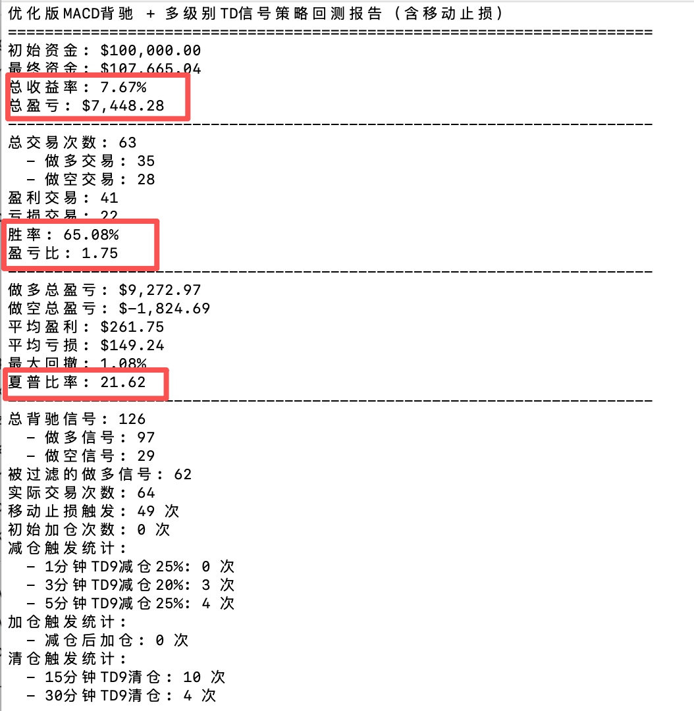

# 📈 Chanlun Quant Trading System

一个基于缠论（Chanlun）理论构建的自动化量化交易系统，结合历史数据训练、严格风控与实盘执行，致力于实现稳定且可持续的收益表现。

回测收益年化80%+！欢迎订阅信号和实盘测试。

### 联系海哥 （订阅信号&实盘对接测试）
- telegram: http://t.me/haigechanlun
- 公众号：海哥缠论
- 推特：https://x.com/haigechanlun666
- 微信：roganwu32 

### 实盘对接流程
- 注册新账号推荐gate交易所，注册链接：https://www.gatenode.xyz/share/VVNAULXZAG  邀请码：VVNAULXZAG
- 开通合约api读取和交易权限把key给我们
- 转账到合约账户

---

## 🚀 核心特性

### 1️⃣ 缠论买卖点识别（AI + 规则引擎）
- 基于 **近2年K线数据** 进行结构化训练与验证
- 自动识别：
  - 中枢结构
  - 笔 / 线段演化
  - 一买 / 二买 / 三买 & 一卖 / 二卖 / 三卖
- 支持多周期联动（1H / 4H / 日线）

---

### 2️⃣ 全自动化交易执行
- 实现从信号生成 → 下单执行 → 持仓管理全流程自动化
- 支持主流交易所 API 对接
- 可扩展策略模块（支持多策略并行）

---

### 3️⃣ 风控管理体系（Risk Control Engine）
- 仓位动态控制（Position Sizing）
- 单笔风险限制
- 最大回撤控制（Max Drawdown Protection）
- 高频异常波动过滤机制

---

### 4️⃣ 移动止盈止损（Trailing System）
- 动态止盈（趋势跟随）
- 自适应止损（基于结构/波动率）
- 支持：
  - 固定比例 d
  - ATR 波动模型
  - 缠论结构止损

---

### 5️⃣ 回测表现（Backtesting）
- 回测周期：近1年历史数据
- 年化收益率：**> 85%**
- 风险收益比（Sharpe Ratio）表现卓越
- 支持多市场验证（Crypto / Forex）

> ⚠️ 注：历史回测不代表未来收益，市场具有不确定性

---

### 常用技术分析信号监控
- [td 迪马克序列、神奇九转](./monitor/td.py)
- td实战教程:https://mp.weixin.qq.com/s/5A8oKSIA0tQN8OAsDdtKiQ

---

### k线行情
- 采用binance数据源 [代码实现](./data/binance_api.py)

---

### 实盘交易
- 支持binance、okx、gate、weex
- 以gate api为例，[代码实现](./trade/gate/trade.py)

---
### 核心策略
- 根据历史2年k线训练缠论买卖点得到一个实时决策的算法模型（不开源，有需要跑实盘的可以联系我们）

### 开源策略（策略仅供参考，实盘有风险）
- MACD背驰 + TD信号动态加仓、减仓策略
  - [实现代码](./strategy/live_trading_macd_td.py)
  - [回测代码](./strategy/backtest_macd_td.py)
  - 最近10天回测数据：
  - 
  - 

